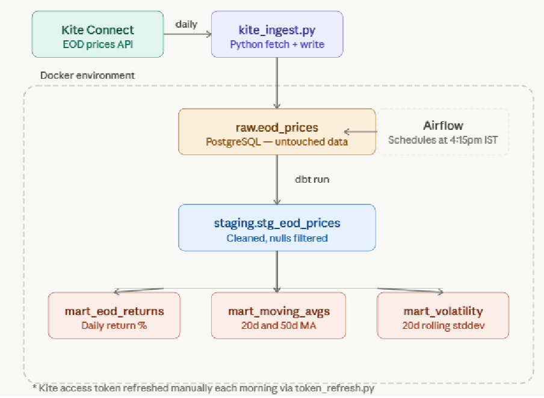

# NSE EOD Market Data Pipeline

A production-style end-of-end data pipeline that fetches daily closing prices 
for 135 NSE large-cap stocks, lands raw data in PostgreSQL, and transforms it 
into an analytical layer using dbt. Fully containerised with Docker and 
orchestrated by Apache Airflow.

## Architecture



## Stack

- **Orchestration:** Apache Airflow (LocalExecutor, Docker)
- **Data source:** Zerodha Kite Connect API
- **Storage:** PostgreSQL
- **Transformation:** dbt
- **Containerisation:** Docker + Docker Compose

## Data layers

| Layer | Schema | Description |
|---|---|---|
| Raw | `raw.eod_prices` | Untouched OHLCV from Kite |
| Staging | `staging.stg_eod_prices` | Cleaned, nulls filtered |
| Marts | `marts.*` | Returns, moving averages, volatility |

## dbt models

- `mart_eod_returns` — daily return % using LAG on close prices
- `mart_moving_averages` — 20-day and 50-day moving averages
- `mart_volatility` — 20-day rolling volatility from return stddev

## Setup

1. Clone the repo
2. Copy `.env.example` to `.env` and fill in credentials
3. Add your FNO stock universe Excel file to `scripts/fno_stocks.xlsx`
4. Run `docker compose build`
5. Run `docker compose run --rm airflow-init`
6. Run `docker compose up -d`
7. Access Airflow UI at `http://localhost:8080`

## Daily operation

Each trading day before 4pm IST:

```bash
python scripts/token_refresh.py
docker compose down && docker compose up -d
```

Airflow triggers the pipeline automatically at 4:15pm IST on weekdays.

## Design decisions

- `ON CONFLICT DO NOTHING` on insert makes every run idempotent
- Staging modelled as views, marts as tables for query performance
- dbt dependency chain ensures correct execution order automatically
- Port 5433 exposed on host to avoid conflict with any local PostgreSQL

## Stock universe

135 NSE large-cap stocks from the F&O segment.